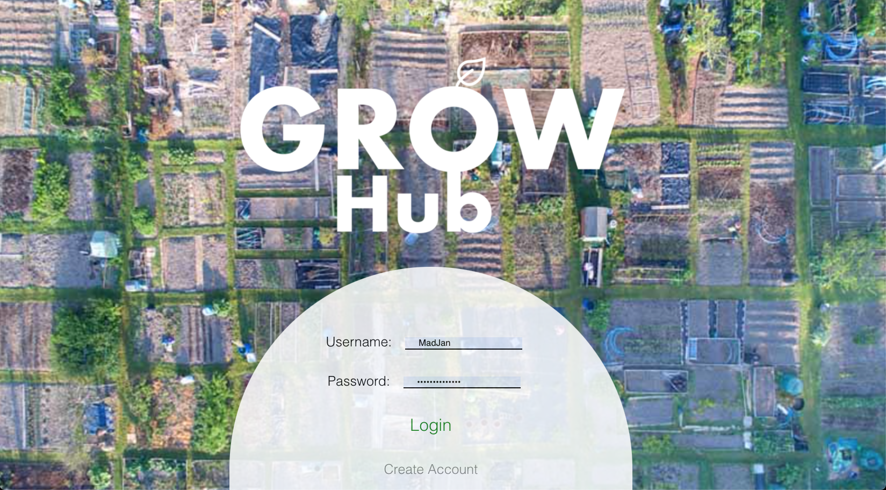
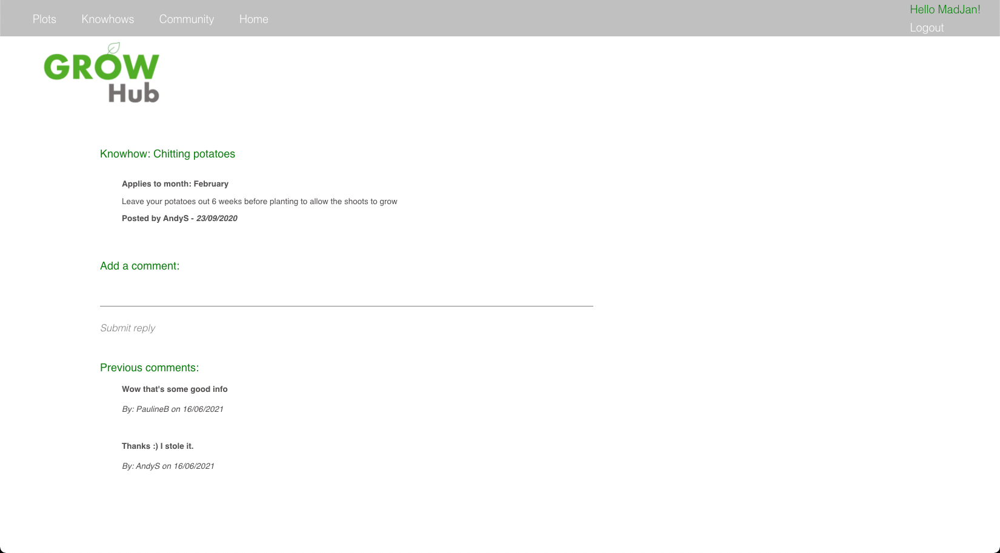
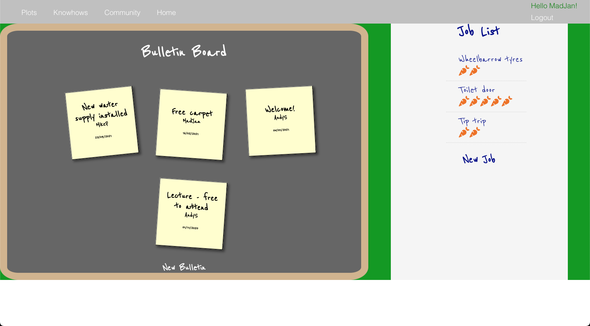

# GrowHub

Growing your own food is an increasingly attractive hobby for many. People rent plots in allotments, and across many years gain a vast array of knowledge and experience, but still face trial and error each time they try something new. 

For all we know, the person who owns the plot right next to them has had success on said vegetable or growbed construction years back, but we don't know, and neither do those attempting to grow it or built it themselves. And one day, all of these people will have left and taken all the knowledge with them. The cycle begins anew.

What we wanted to build, was a online portal that could not only offered a bank of shared knowledge, but could encourage active engagement amongst plotholders.

In the short space of one week, we have completed our first iteration of such, called GrowHub.

GrowHub, offers the opportunity for community.

## Technology used
* The server was created with Java and Spring, using IntelliJ.
* The client was created with JavaScript and React, using Visual Studio Code.

## Getting Started

The following steps will get the app working locally for you.

### Starting the Server
* Download a copy the Growbub_Server repo, and unzip
* Open up a terminal window, and set the location to the Growhub_Server folder
* Open up Growhub_Server in a capable suite (we used IntelliJ)
* Run 'ServerApplication.java' to start up the server

### Starting the Client 
* Download a copy the Growbub_Client repo, and unzip
* Open up a terminal window, and set the location to the Growhub_Client folder
* In the terminal, run 'npm i'to install all relevant dependencies
* After completion, run 'npm start' to start up the front end of the app
* Open up 'http://localhost:3000' in your browser
* Log in with username 'MadJan', password 'madjanlovesjam' for the best experience

## Basic functionality

Initial log in page, styled to be a polytunnel:

Once logged in, a user is directed to the dash board. They are presented with the current weather in the location of the allotment, a select number of bulletin posts by adminstrators, and a tip of the month.

They can then view all the plots in the allotment, see who owns them if they also a registered user, the size, and any notes the plot owner has added. These could be what they are currently growing, what improvements they have made, and any tips to help track their plot. A user can add such comments to their own plots.

The bank of knowledge, knowhows, displays all local tips - particularly relevant to the Scottish climate when it comes to growing exotic vegetables. A user can add their own which they can edit and delete at will, and all users can comment on knowhows, reply to one another with additional tips.

Comments:

All users can post fun news that appear as sticky notes, and the top three most recent ones posted by admins only, are then rendered on the dash board we saw earlier. Jobs display any tasks users need help with, with their difficulty of 1-5 represented by the number of carrots. Likewise as with knowhows, a user can edit and delete only their own bulletins and knowhows.

## Next Steps

The following features are other possible routes the project could take next.
* The Plots will be rendered via an interactive map of the actual allotment
* Greater admin functionality - ability to delete any posts, view users and have basic functionality such as removing accounts, and assigning plots to users
* A forum for seed and harvest swaps for excess produce, to further enhance the desire for community
* Scalability for other allotments